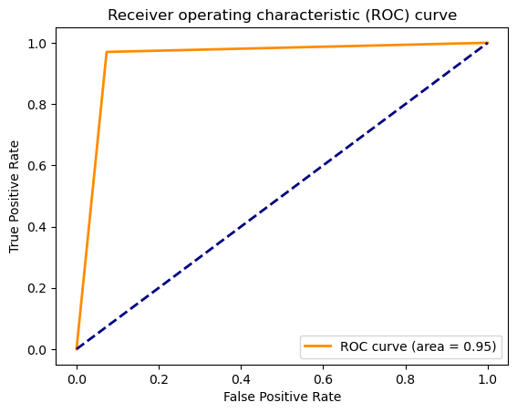

ILD_Segmentation_Classification
==============================

This Repository contains code of our work on Segmenting Lung CT Images and classifying Interstitial Lung Diseases Using Deep Learning, submitted to the Respirology journal.

## Folders:
	Lung_Classification: Contains code for lung disease classification.
	Lung_Segmentatopn: Contains code for lung segmentation.
	Figures: Plots generated for the paper
	example_notebooks: Contains example notebooks for both above tasks, which can be downloaded and run with user-data.

## Files:
	 ┣ Root
	 ┣ Lung_Classification
	 ┃ ┣ data_helpers.py      # Preprocessing and loading data for model input and evaluation 					
	 ┃ ┣ dicom_utils.py       # Helper script to convert dicom images to numpy arrays or pngs
	 ┃ ┣ eval.py              # Helper script for evaluating model on unseen data,and visualizing metrics and plots like ROC curve
	 ┃ ┣ models.py            # Classifier model for the classification task, plus an Autoencoder (**Under development**)
	 ┃ ┗ train.py             # Helper script for training model on data processed using data_helpers.py,and saving the model
	 ┣ Lung_Segmentation
	 ┃ ┣ data_helpers.py      # Preprocessing and loading data for model input and evaluation 
	 ┃ ┣ eval.py              # Helper script for evaluating model on unseen data
	 ┃ ┣ loss.py              # Loss functions used in the model training 
	 ┃ ┣ metrics.py           # Collection of segmentation metrics including mIOU, Dice, Tversky loss and Focal loss.
	 ┃ ┣ models.py            # Segmentation models used in the paper (**Under development: Hyper-parameter tuning using RayTune**)
	 ┃ ┣ train.py             # Helper script for training model on data processed using data_helpers.py,and saving the model (Segmentation)
	 ┃ ┣ utils.py             # Miscillenous functions used as utility functions
	 ┃ ┗ visualize_helpers.py # Script to visualize model predictions
	 ┣ README.md
	 ┗ requirements.txt
	


### Install Requirements Using the below code
```python
pip install -r requirements.txt
```

## Convert DICOM images to Jpeg images and numpy arrays using the dicom_utils.py file.

 ```python
 get_names(path)
 for name in names:
     final_image = convert_dcm_jpg(cdir, name)
     final_image.save(out_dir + '/' + name + '.jpg')
  ```
## Lung Segmentation Results For Models implemented

### 1. Performance on Geneva HRCT Dataset (12 classes, 512 x 512)

Training: 256x256 reshaped
validation: 256x256 reshaped

| Model        | Batch_Size | mIOU   | DSC    | Accuracy | Google Drive                                |  
|--------------|------------|--------|--------|----------|---------------------------------------------|
| UNET         | 10         | 0.8280 | 0.8604 | 0.9848   | [Link text Here](https://link-url-here.org) |   
| Attn_UNET    | 10         | 0.8394 | 0.8708 | 0.9901   | [Link text Here](https://link-url-here.org) |   
| R2_UNET      | 10         | **0.9191** | 0.8811 |**0.9934**   | [Link text Here](https://link-url-here.org) |   
| Attn_R2_UNET | 10         | 0.8523 | **0.9263** | 0.9913   | [Link text Here](https://link-url-here.org) |  
|              |            |        |        |          |                                             |  

### 2. Segmentation Results on Geneva-HRCT Dataset (All Networks)

<div>

</div>

<div>

</div>

<div>

</div>

### 3. Disease Classification Results 

## HP vs IPF Classification

|              | precision | recall | f1-score | support |
|--------------|-----------|--------|----------|---------|
| HP           | 0.97      | 0.93   | 0.95     | 82      |
| IPF          | 0.92      | 0.97   | 0.94     | 67      |
| Accuracy     |           |        | 0.95     | 149     |
| macro avg    | 0.94      | 0.95   | 0.95     | 149     |
| weighted_avg | 0.95      | 0.95   | 0.95     | 149     |

# AUC ROC Curve

<div>

</div>


--------

