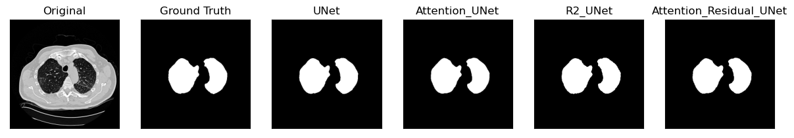
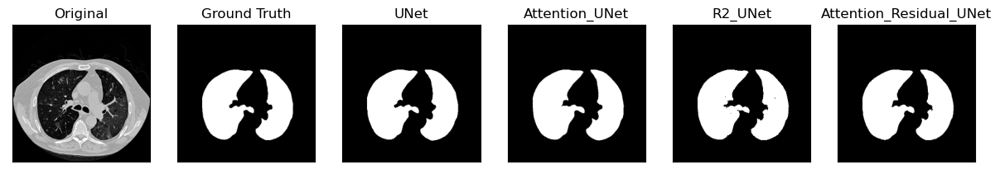
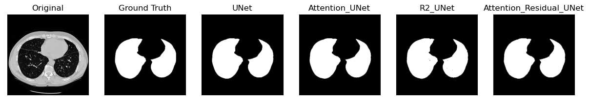

ILD-Segmentation-Classification
==============================

This Repository contains code of our work on Segmenting Lung CT Images and classifying Interstitial Lung Diseases Using Deep Learning, submitted to the Imaging Systems And Technology journal.

## Folders:
	Lung_Classification: Contains code for lung disease classification.
	Lung_Segmentatopn: Contains code for lung segmentation.
	Figures: Plots generated for the paper
	example_notebooks: Contains example notebooks for both above tasks, which can be downloaded and run with user-data.

## Files:
	 ┣ Root
	 ┣ Lung_Classification
	 ┃ ┣ data_helpers.py      # Preprocessing and loading data for model input and evaluation 					
	 ┃ ┣ dicom_utils.py       # Helper script to convert dicom images to numpy arrays or pngs
	 ┃ ┣ eval.py              # Helper script for evaluating model on unseen data,and visualizing metrics and plots like ROC curve
	 ┃ ┣ models.py            # Classifier model for the classification task, plus an Autoencoder (**Under development**)
	 ┃ ┗ train.py             # Helper script for training model on data processed using data_helpers.py,and saving the model
	 ┣ Lung_Segmentation
	 ┃ ┣ data_helpers.py      # Preprocessing and loading data for model input and evaluation 
	 ┃ ┣ eval.py              # Helper script for evaluating model on unseen data
	 ┃ ┣ loss.py              # Loss functions used in the model training 
	 ┃ ┣ metrics.py           # Collection of segmentation metrics including mIOU, Dice, Tversky loss and Focal loss.
	 ┃ ┣ models.py            # Segmentation models used in the paper (**Under development: Hyper-parameter tuning using RayTune**)
	 ┃ ┣ train.py             # Helper script for training model on data processed using data_helpers.py,and saving the model (Segmentation)
	 ┃ ┣ utils.py             # Miscellenous functions used as utility functions
	 ┃ ┗ visualize_helpers.py # Script to visualize model predictions
	 ┣ README.md
	 ┗ requirements.txt
	


## Install Requirements Using the below code
```python
pip install -r requirements.txt
```

## Convert DICOM images to Jpeg images and numpy arrays using the dicom_utils.py file.

 ```python
 get_names(path)
 for name in names:
     final_image = convert_dcm_jpg(cdir, name)
     final_image.save(out_dir + '/' + name + '.jpg')
  ```

## Dataset Description And Availability

We used a multimedia collection of cases with interstitial lung diseases (ILDs) built at the University Hospitals of Geneva (HUG). The dataset contains high-resolution computed tomography (HRCT) image series with three-dimensional annotated regions of pathological lung tissue along with clinical parameters from patients with pathologically proven diagnoses of ILDs. The library contains 128 patients affected with one of the 13 histological diagnoses of ILDs, 108 image series with more than 41liters of annotated lung tissue patterns as well as a comprehensive set of 99 clinical parameters related to ILDs. The database is available for research on request and after signature of a [license agreement](https://medgift.hevs.ch/wordpress/wp-content/uploads/2023/02/ILD_DB_EndUserAgreement_2023.pdf). A comprehensive description of the dataset can be found in [this](https://www.sciencedirect.com/science/article/pii/S0895611111001017?via%3Dihub) paper. For detailed instructions please visit [this](https://medgift.hevs.ch/wordpress/databases/ild-database/) webpage.


## Lung Segmentation Results For Models implemented

### 1. Performance on Geneva HRCT Dataset (12 classes, 512 x 512)

Training: 256x256 reshaped
validation: 256x256 reshaped

| Model        | Batch_Size | mIOU   | DSC    | Accuracy | Google Drive                                |  
|--------------|------------|--------|--------|----------|---------------------------------------------|
| UNET         | 10         | 0.8280 | 0.8604 | 0.9848   | [Download](https://drive.google.com/file/d/1mrTg95Bm0SSlLEzZphUu3wYFkYE7G-vD/view?ts=640f3ed6) |   
| Attn_UNET    | 10         | 0.8394 | 0.8708 | 0.9901   | [Download](https://drive.google.com/file/d/1ZkiMf9-5Z861D2xdqpABC3-2li9mCjPw/view?usp=sharing_eil_m&ts=640f3ed6) |   
| R2_UNET      | 10         | **0.9191** | 0.8811 |**0.9934**   | [Download](https://drive.google.com/file/d/1AX8ABi2fGhylJFTLaKoWArSZXG_O35VS/view?usp=sharing_eil_m&ts=640f3ed6) |   
| Attn_R2_UNET | 10         | 0.8523 | **0.9263** | 0.9913   | [Download](https://drive.google.com/file/d/1ZTFNYRzSsz8XRPVyZ27lRU_zu5VwSaKZ/view?usp=sharing_eil_m&ts=640f3ed6) |  
|              |            |        |        |          |                                             |  

### 2. Segmentation Results on Geneva-HRCT Dataset (All Models)

<div>

</div>

<div>

</div>

<div>

</div>

# Model Validation Loss vs Epochs plots

<p float="left">
  
   

</p>

<p float="left">
  
   

</p>


### 3. Disease Classification Results 

## HP vs IPF Classification

|              | precision | recall | f1-score | support |
|--------------|-----------|--------|----------|---------|
| HP           | 0.97      | 0.93   | 0.95     | 82      |
| IPF          | 0.92      | 0.97   | 0.94     | 67      |
| Accuracy     |           |        | 0.95     | 149     |
| macro avg    | 0.94      | 0.95   | 0.95     | 149     |
| weighted_avg | 0.95      | 0.95   | 0.95     | 149     |

## ROC Curve and Model accuracy vs epoch


<p float="left">
  
   

</p>

## HP vs Non HP Classification

|              | precision | recall | f1-score | support |
|--------------|-----------|--------|----------|---------|
| HP           | 0.97      | 0.93   | 0.95     | 82      |
| IPF          | 0.92      | 0.97   | 0.94     | 67      |
| Accuracy     |           |        | 0.95     | 149     |
| macro avg    | 0.94      | 0.95   | 0.95     | 149     |
| weighted_avg | 0.95      | 0.95   | 0.95     | 149     |

## ROC Curve and Model accuracy vs epoch


<p float="left">
  
   

</p>


--------

## References

Todo

## Todo
Add a Variational Autoencoder implementation
